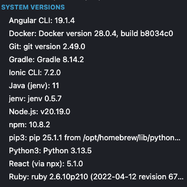

#  System Versions Explorer

A simple and handy **Visual Studio Code extension** that shows versions of popular development tools directly in the **Explorer sidebar**. Know your environment at a glance no need to open your terminal.

---

## 🚀 Features

- ✅ **Auto-detection** of installed tools at startup
- 🔍 Only displays tools **found** on your system
- 🔄 **One-click refresh** via sidebar title button
- ✨ **Organized output**, sorted **alphabetically**
- 📂 **Sidebar-friendly**, minimal and fast

---

<!-- TOOLS_TABLE_START -->
## 🛠️ Supported Tools

| Tool | Command |
|------|---------|
| Node.js | `node --version` |
| npm | `npm --version` |
| Python | `python --version` |
| Python3 | `python3 --version` |
| Java | `java --version` |
| Java (jenv) | `jenv global` |
| Git | `git --version` |
| Angular CLI | `ng --version` |
| TypeScript | `tsc --version` |
| Docker | `docker --version` |
| yarn | `yarn --version` |
| pip | `pip --version` |
| pip3 | `pip3 --version` |
| Maven | `mvn --version` |
| Gradle | `gradle --version` |
| Go | `go version` |
| Rust | `rustc --version` |
| PHP | `php --version` |
| Ruby | `ruby --version` |
| React (via npx) | `npx create-react-app --version` |
| Vue CLI | `vue --version` |
| Vite | `vite --version` |
| Next.js | `next --version` |
| Nuxt | `nuxt --version` |
| Svelte | `svelte --version` |
| React Native CLI | `react-native --version` |
| Flutter | `flutter --version` |
| Ionic CLI | `ionic --version` |
| Cordova | `cordova --version` |
| pnpm | `pnpm --version` |
| nvm | `nvm current` |
| pyenv | `pyenv --version` |
| rbenv | `rbenv --version` |
| jenv | `jenv --version` |
<!-- TOOLS_TABLE_END -->

Want support for more tools? [Open an issue](https://github.com/til0r/system-versions/issues/new) or contribute!

---

## 📸 Preview

---

## 📥 Installation

You can install **System Versions Explorer** from the [Visual Studio Code Marketplace](https://marketplace.visualstudio.com/items?itemName=til0r.system-versions).

Or directly from VS Code:

1. Open the Extensions panel
2. Search for `System Versions Explorer`
3. Click **Install**

---

## 🧪 Getting Started

Once installed:

- Open the **Explorer** sidebar in VS Code
- Locate the **System Versions** view
- Click the **refresh icon** (↻) to fetch the latest versions
- Only tools **available on your system** will appear

---

## 🤝 Contributing

We love contributors! Whether it's a bug fix, feature request, or a new tool support:

- Read our [CONTRIBUTING.md](CONTRIBUTING.md)
- Open a [pull request](https://github.com/til0r/system-versions/pulls) or [issue](https://github.com/til0r/system-versions/issues)

---

## 📄 License

Licensed under the [MIT License](LICENSE).

---

## 🌐 Author

Created with ❤️ by [til0r](https://github.com/til0r)
